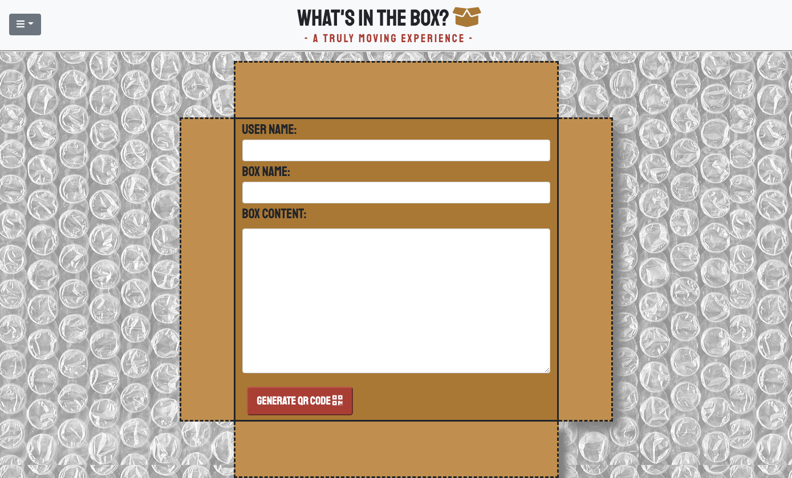
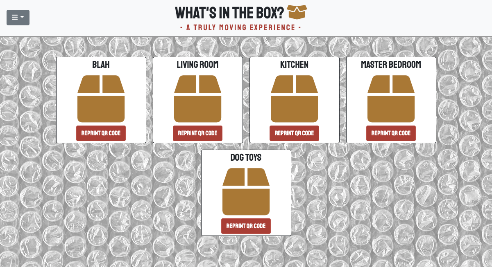
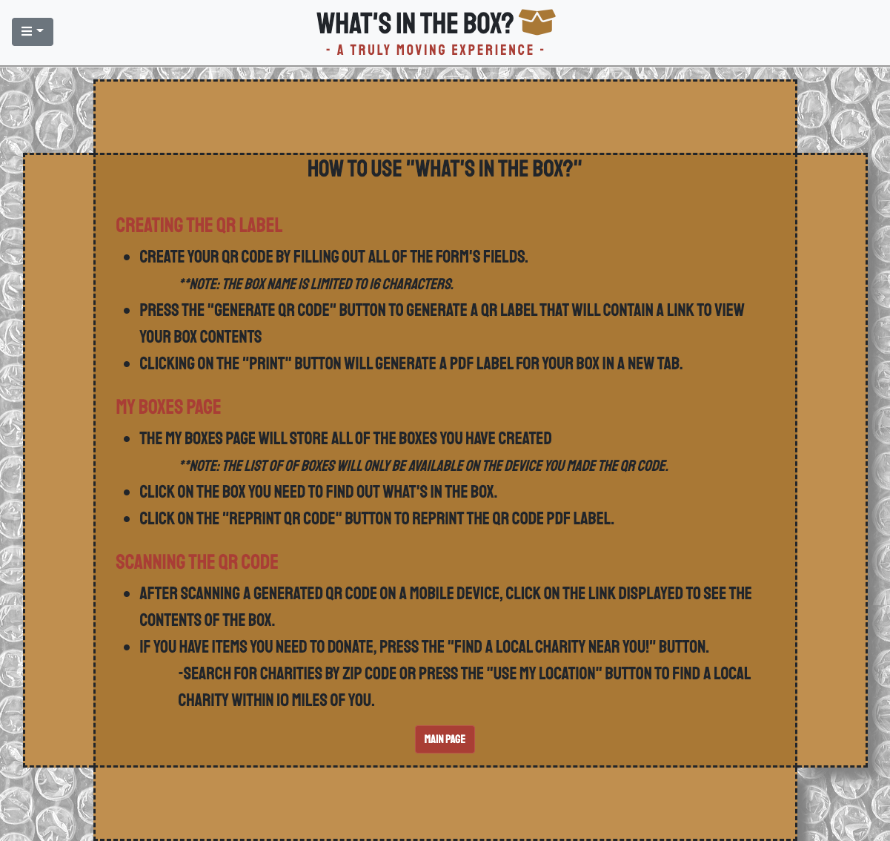
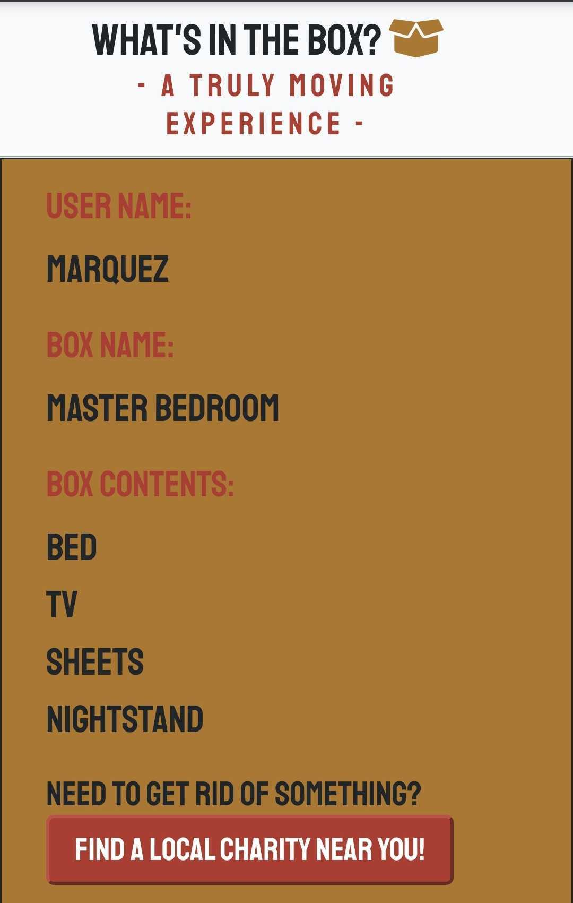

# What's in the Box?
 An application for tracking the context of boxes packed for household moving and storage projects

## Purpose

This Repository is used to develop and display a moving box content application that allows the user to name and create a list of contents converted into a printable QR label.  Furthermore, the user can scan the code with their phone's camera app and be taken to a link displaying their box content and search for the nearest charity organizations.

### Technologies
* HTML
* JavaScript
* jQuery
* qrcode.js jQuery Library
* CSS
* Bootrap CSS Framework
* Font Awesome Icon Toolkit
* Google fonts

### Third-Party APIs

* Paste - [documentation](https://pastee.github.io/docs/)

* HTML to PDF Conversion API - [documentation](https://html2pdf.app/)
* cors-anywhere - [documentation](https://github.com/Rob--W/cors-anywhere/#documentation)
* OrgHunter Charity Search - [documentation](http://charityapi.orghunter.com/charity-api-list)
* Google Maps - [documentation](https://developers.google.com/maps/documentation/urls/get-started)

## Installation
Link to Github Repository: https://github.com/pkriengsiri/whats-in-the-box

Copy the contents of our repository to the server where it will be deployed.


The application shown in the usage section below was deployed using GitHub Pages.  The repository can be replicated by via fork, clone, and redeployment with GitHub Pages.

## Usage
Link to the deployed application: https://pkriengsiri.github.io/whats-in-the-box/






=======


````
Creating and displaying a  QR Label: 

- Add your name
- Name your box
- List the contents of your box
- Press the "Generate your QR code" button and "Print" button
- Place the label on your box
- Scan the label with your phone, follow the link to view the contents
  
Viewing the contents of your box:

-Scan the QR label with your phone or select the "My Boxes" page from the dropdown menu
-Your box contents are stored via local storage and will only be accessible from that device used to create the QR label.
-Click the box you would like to see the contents of

Finding a Charity:

-While viewing the contents of your box, 
-Press the "Find a local charity near you!" button and search within 10 miles of the zip code of the area you wish to donate to 
-Press the use my location button to find a local charity within 10 miles of you.
  
````


## Contributors / Credit
### Pete Kriengsiri
https://github.com/pkriengsiri

### Molly McCollum
https://github.com/mollymccollumwx

### Mugi Chultemsuren
https://github.com/mugich

### Marquez Brown
https://github.com/Marquez-Brown


## Recent Changes
12-28-2020 Displaying the QR Code

12-28-2020 Scanning the QR Code

12-29-2020 Styling the Main Page

12-29-2020 Displaying List of Boxes

12-31-2020 Created About Us Page

01-01-2021 Added the Charity API

## License
MIT License
Copyright (c) 2021 Marquez Brown, Molly McCollum, Mugi Chultemsuren, Pete Kriengsiri

Permission is hereby granted, free of charge, to any person obtaining a copy
of this software and associated documentation files (the "Software"), to deal
in the Software without restriction, including without limitation the rights
to use, copy, modify, merge, publish, distribute, sublicense, and/or sell
copies of the Software, and to permit persons to whom the Software is
furnished to do so, subject to the following conditions:

The above copyright notice and this permission notice shall be included in all
copies or substantial portions of the Software.

THE SOFTWARE IS PROVIDED "AS IS", WITHOUT WARRANTY OF ANY KIND, EXPRESS OR
IMPLIED, INCLUDING BUT NOT LIMITED TO THE WARRANTIES OF MERCHANTABILITY,
FITNESS FOR A PARTICULAR PURPOSE AND NONINFRINGEMENT. IN NO EVENT SHALL THE
AUTHORS OR COPYRIGHT HOLDERS BE LIABLE FOR ANY CLAIM, DAMAGES OR OTHER
LIABILITY, WHETHER IN AN ACTION OF CONTRACT, TORT OR OTHERWISE, ARISING FROM,
OUT OF OR IN CONNECTION WITH THE SOFTWARE OR THE USE OR OTHER DEALINGS IN THE
SOFTWARE.

## Badges
[](https://github.com/pkriengsiri/whats-in-the-box/issues)
[](https://github.com/pkriengsiri/whats-in-the-box/stargazers)
[](https://github.com/pkriengsiri/whats-in-the-box)


## Contributions

To help add functionality, debugging, or refactoring the code, please contact one of our team members to request access as a collaborator.
